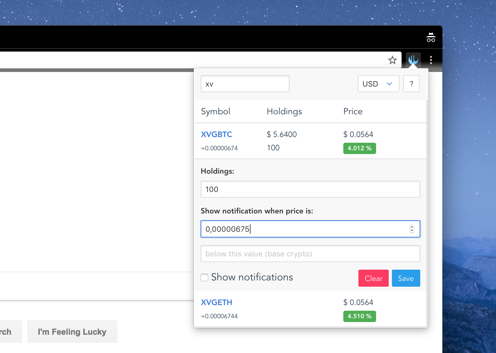

# Bintick

Chrome extension for tracking crypto stats from binance exchange with notifications and some sort of portfolio functionality.

The value of cryptos that end with ETH, BNB, USDT are based on the values of BTC.

Data get updated every minute.



## Build

``` bash
yarn install

yarn run build
```

## License

[MIT](./LICENSE)


<sub>Not sure if it's gonna work but... :D</sub><br/>
<sub>BTC: 1DcDVWdWsPiqNhtsgZgUHg1jtkmMuCr3Qd</sub><br/>
<sub>LTC: LP5wEmKc7vjTKAwkbU4fJeMFUhE8pCmbHo</sub><br/>
<sub>ZEC: t1bym8jLN25iAHxnkmU96kUTaPpcu4XMwXv</sub><br/>
<sub>XRP: rNKBi8ZPTGgBytZokUhT3QYWabrTtZSVjy</sub><br/>
<sub>XVG: DHfHMRYtvVQkrm4dFdrRcSLcn4x25nFEXP</sub>
